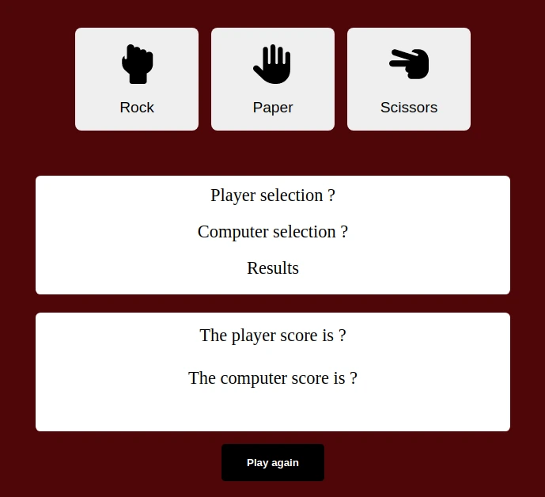
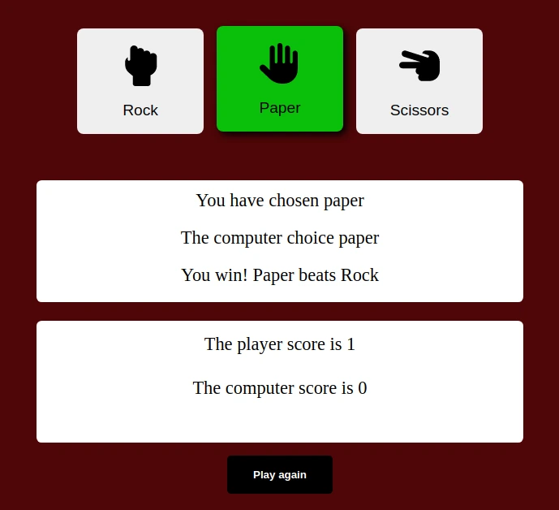
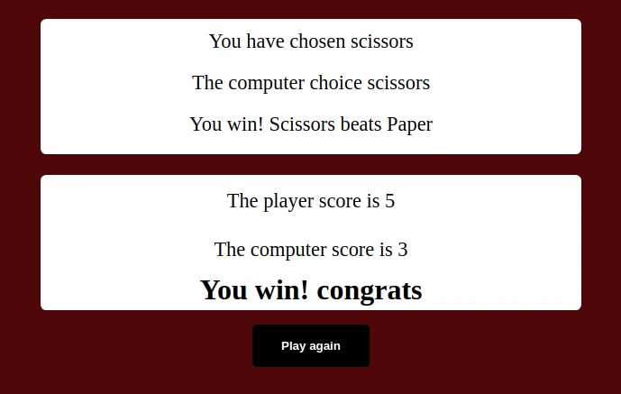

# The Odin Project - Foundations Course - Rock Paper Scissors solution

This is a solution to the  [Rock Paper Scissors](https://www.theodinproject.com/lessons/foundations-rock-paper-scissors). The Odin Project provides a free open source coding curriculum that can be taken entirely online.

# What I learned

- Work with variables and strings
- Work with JavaScript functions
- Use switch statement
- Edit the DOM with JavaScript
- Work with branches in Git

# Screenshots

